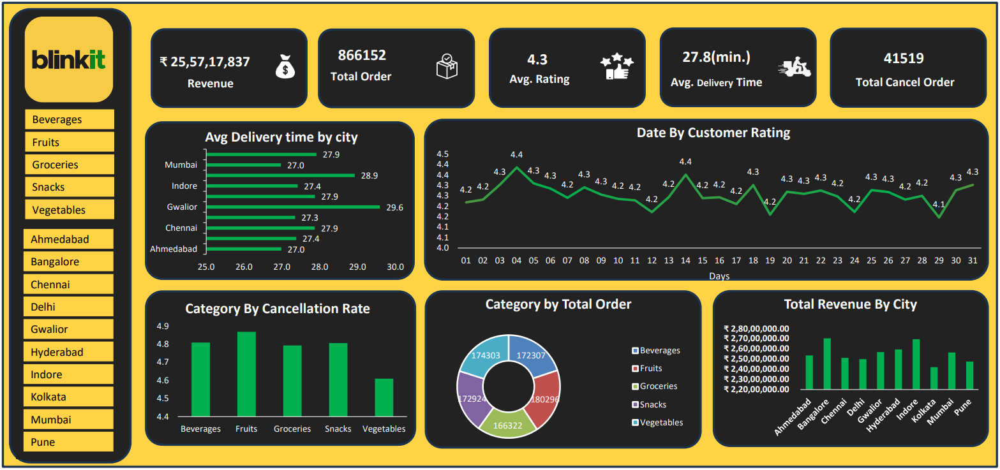

# 📊 Blinkit Interactive Excel Dashboard | Data Analyst Project

This project presents an **interactive Excel dashboard** analyzing Blinkit's sales and delivery performance across major Indian cities. It includes raw data, cleaned files, a professional Excel dashboard, and a preview image — ideal for data analyst portfolios and real-world analytics simulation.

---

## 📁 Project Structure

| Folder              | Description                                           |
|---------------------|-------------------------------------------------------|
| `raw_data/`         | Raw input data (`raw.csv`)                            |
| `excel_report/`     | Final interactive dashboard (`blinkit_dashboard.xlsx`)|
| `dashboard_images/` | Dashboard screenshot (`dashboard_preview.png`)        |

---

## 📊 Key Business KPIs Visualized

- 💰 **Total Revenue:** ₹25,57,17,837  
- 📦 **Total Orders:** 8,66,152  
- ⭐ **Average Rating:** 4.3  
- 🚚 **Average Delivery Time:** 27.8 minutes  
- ❌ **Cancelled Orders:** 41,519  

---

## 📈 Dashboard Features

- 🏙️ **City-wise Delivery Time & Revenue**  
- 🛒 **Category-wise Orders & Cancellation Rates**  
- ⭐ **Daily Customer Ratings Trend**  
- 📊 **Dynamic Visuals with Slicers and Pivot Charts**  
- 🎯 **KPI Cards** for quick business insights

---

## 🛠️ Tools & Skills Demonstrated

- Microsoft Excel  
- Pivot Tables & Charts  
- Slicers & Interactivity  
- Conditional Formatting  
- Dashboard Design Best Practices  
- Data Cleaning & Transformation

---

## 📷 Dashboard Preview

---

## 🚀 How to Use

1. Download `excel_report/blinkit_dashboard.xlsx`
2. Open in Microsoft Excel (desktop)
3. Explore KPIs with slicers (cities & categories)
4. Modify visuals or extend the dashboard as needed

---

## 🎯 Purpose & Outcome

> This project replicates a real-world data analytics task: transforming raw delivery and sales data into actionable insights through Excel. It's ideal for showcasing Excel skills in dashboards, interactivity, business analysis, and data storytelling.

---

## 👤 Author

**Atul Verma**  
[LinkedIn: linkedin.com/in/atul-verma25](https://www.linkedin.com/in/atul-verma25)  
[GitHub: github.com/Atulv25](https://github.com/Atulv25)

---

